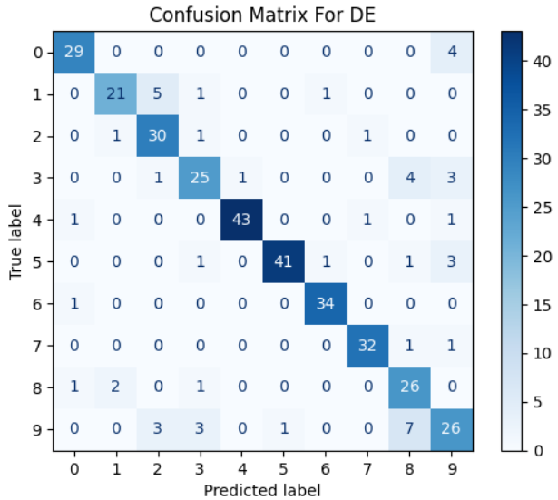
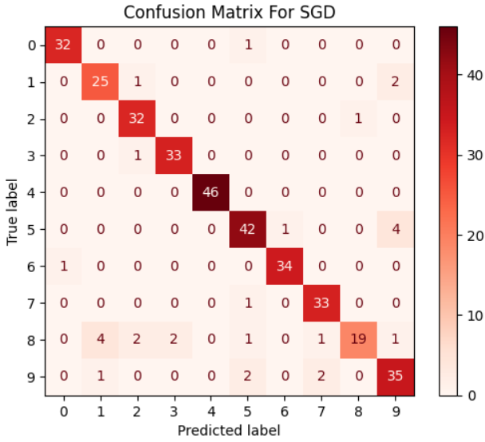

# Differential Evolution for Neural Networks Optimization
Optimizing Artificial Neural Network weights' using Differential Evolution and comparison with traditional backprop algorithms (Stochastic Gradient Descent)

## Screenshots

